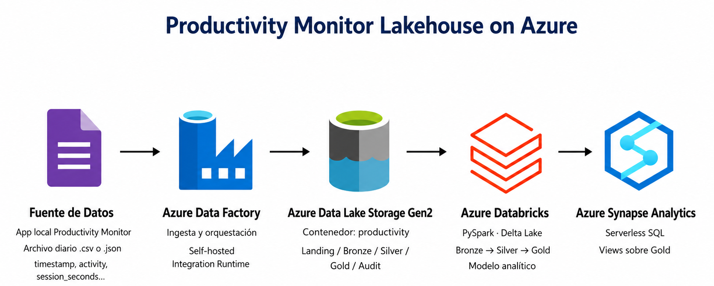

# Az-ProductivityMonitor — Productivity Monitor Lakehouse on Azure

> **Note:** This is a self-directed learning project created to practice and demonstrate Azure Data Engineering concepts using a public IoT dataset. It is not based on a real business implementation or production environment.

Az-ProductivityMonitor is a data engineering project built on Azure to ingest, process, model, and expose productivity monitoring data generated by a local desktop application.

The project implements a lakehouse architecture using Azure Data Factory, Azure Data Lake Storage Gen2, Azure Databricks, Delta Lake, and Azure Synapse Analytics Serverless SQL.

The current documented scope of the project goes from local file ingestion to the Synapse Serverless SQL serving layer. Reporting consumption was validated through the Synapse Serverless SQL endpoint, but the final Power BI semantic model and dashboards are outside the confirmed scope of this documentation.

## Project Scope

Implemented:

- Azure Data Factory ingestion from a local folder.
- Self-hosted Integration Runtime for local file access.
- Azure Data Lake Storage Gen2 as the lake storage layer.
- Azure Databricks processing with PySpark and Delta Lake.
- Bronze, Silver, and Gold Medallion layers.
- Gold analytical model with fact and dimension tables.
- Azure Synapse Analytics Serverless SQL serving layer.
- SQL views over Gold Delta Lake folders.

## Data Source

The source data is generated by a local Productivity Monitor desktop application.

The application produces daily productivity files in either CSV or JSON format. These files are stored in a local folder and ingested into Azure Data Lake Storage Gen2 without applying business transformations in Azure Data Factory.

Confirmed local source folder:

```text
C:\ProductivityMonitor\Reports
```

Expected source columns:

```text
timestamp
level
face_front
input_active
session_seconds
attentive_seconds
productive_seconds
activity
```

## Architecture Summary



For a detailed architecture diagram please check - [02 Architecture](docs/02_architecture.md).


## Main Technologies

- Azure Data Factory
- Self-hosted Integration Runtime
- Azure Data Lake Storage Gen2
- Azure Databricks
- PySpark
- Delta Lake
- Azure Synapse Analytics Serverless SQL
- T-SQL

## Repository Structure

```text
.
├── README.md
├── docs/
│   ├── 01_project_overview.md
│   ├── 02_architecture.md
│   ├── 03_adf_ingestion.md
│   ├── 04_databricks_processing.md
│   ├── 05_synapse_serving_layer.md
│   ├── 06_data_model.md
│   └── 07_results_and_conclusions.md
├── adf/
│   ├── pipelines/
│   ├── datasets/
│   ├── linked_services/
│   └── triggers/
├── databricks/
│   └── notebooks/
├── synapse/
│   └── sql/
└── assets/
    └── images/

```

## Documentation

- [01 Project Overview](docs/01_project_overview.md)
- [02 Architecture](docs/02_architecture.md)
- [03 Azure Data Factory Ingestion](docs/03_adf_ingestion.md)
- [04 Azure Databricks Processing](docs/04_databricks_processing.md)
- [05 Synapse Serving Layer](docs/05_synapse_serving_layer.md)
- [06 Gold Data Model](docs/06_data_model.md)
- [07 Results and Conclusions](docs/07_results_and_conclusions.md)

## Final State

The project currently exposes curated Gold Delta Lake data through Synapse Serverless SQL views. The Synapse serving layer is ready for downstream analytical consumption.

## Notes

This project was built for learning and portfolio purposes. The architecture intentionally separates ingestion, processing, storage, and serving responsibilities to practice realistic Azure data engineering patterns.