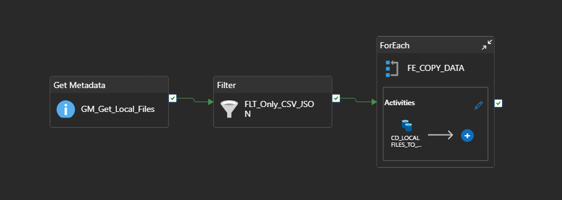
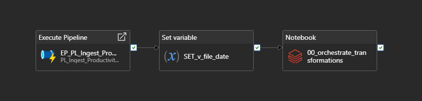

# Azure Data Factory Ingestion Layer

## Overview

Azure Data Factory was implemented as the ingestion and orchestration layer for the Productivity Monitor Lakehouse on Azure project.

The purpose of this phase was to move raw files generated by the local Productivity Monitor desktop application into Azure Data Lake Storage Gen2.

The application produces daily productivity files in either CSV or JSON format. These files are stored locally and then ingested into the Landing zone without applying business transformations in Data Factory.

## Role in the Architecture

Azure Data Factory sits between the local source folder and the ADLS Gen2 Landing zone.

Implemented flow:

```text
Local folder
    ↓
Self-hosted Integration Runtime
    ↓
Azure Data Factory pipeline
    ↓
ADLS Gen2 Landing zone
```

ADF is responsible only for raw file movement. Parsing, schema enforcement, cleansing, casting, and analytical transformations are handled downstream in Databricks.

## Pipelines

The pipelines created for this phase are:

```text
PL_Ingest_ProductivityMonitor_DailyFile:
```



```text
PL_Notebooks_Transform_Orchestration:
```


## Source

Source folder used during implementation:

```text
C:\ProductivityMonitor\Reports
```

The source folder contains daily files generated by the Productivity Monitor desktop application.

Supported file extensions:

```text
.csv
.json
```

## Target

The ADLS Gen2 Landing structure used by the pipeline is:

```text
productivity/productivity-monitor/landing/source=desktop_app/ingest_date=yyyy-MM-dd/
```

Example output path:

```text
productivity/productivity-monitor/landing/source=desktop_app/ingest_date=2026-06-01/file.csv
```

Each ingested file is stored under a date-partitioned Landing folder using the Colombia local date derived from the pipeline execution time.

## Dataset Design

Binary datasets were used because Data Factory is only responsible for moving the raw files as-is.

The implementation required two dataset patterns:

- A folder-level Binary dataset for `Get Metadata`.
- A file-level parameterized Binary dataset for `Copy Data`.

The file name parameter had to be assigned to the dataset `File name` property using:

```text
@dataset().p_file_name
```

The Copy Data source receives the current file name from the `ForEach` loop using:

```text
@item().name
```

## Final Status

The final state of this phase is that files generated locally by the Productivity Monitor application are successfully copied into the ADLS Gen2 Landing zone.

This completes the ingestion layer and prepares the raw data for downstream processing in the lakehouse.